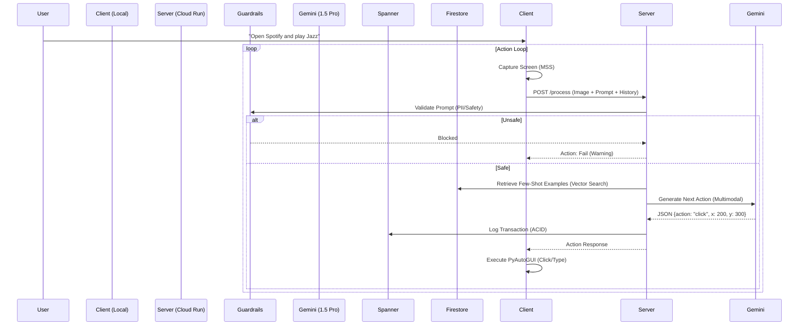

# AccessAI: The Cloud-Native Universal Action Model

**A multimodal AI experiment to bridge the gap between natural language and legacy GUI interfaces.**

---

## 1. The Problem: The Fragility of Traditional Automation
Robotic Process Automation (RPA) has traditionally relied on "selectors"—DOM IDs, XPaths, or window handles. This makes automation brittle; a single CSS change or UI update breaks the entire workflow. Furthermore, millions of legacy Windows applications lack accessible APIs, making them "black boxes" to modern software.

For users with motor impairments, this disconnect is even more critical. Existing accessibility tools often rely on application developers implementing specific accessibility APIs. If an app doesn't support them, the user is locked out.

## 2. The Solution: Visual Action Models (VAM)
**AccessAI** bypasses the underlying code entirely. Instead of hooking into the OS's accessibility tree or the browser's DOM, it uses **Google Gemini 1.5 Pro** to "see" the screen exactly as a human does.

*   **Scenario**: An insurance company uses a VB6 application from 1998 to process claims. It has no API.
*   **AccessAI**: Can visually navigate the archaic menus and input fields just like a human operator, automating data entry tasks that were previously impossible to script.

By treating the UI as a visual input, AccessAI converts natural language intents (e.g., "Find the cheapest shoes on Amazon") into coordinate-based mouse clicks and keystrokes. It is resilient to code changes because it relies on visual semantic understanding, not rigid code selectors.

## 3. Technical Architecture

The system operates on a **Planner-Actor-Critic** loop, distributed between a local Python client and a Cloud Run server.



### 3.1 Component Deep Dive

#### **Client (`intercept/client`)**
*   **Screen Capture**: Uses `mss` for high-performance, cross-platform screen grabbing (avg latency < 10ms).
*   **Action Execution**: `pyautogui` handles HID simulation. It includes a "Fail-Safe" feature—moving the mouse to the screen corner instantly aborts the agent.
*   **Scenario**: Verifying a frontend deployment.
*   **Action**: "Check if the 'Buy Now' button is visible and red."
*   **AccessAI**: Uses its vision capabilities to assert visual states that code-based tests might miss (e.g., a button covered by a z-index overlay).
*   **Action**: "Play some jazz."
*   **AccessAI**: Visually identifies the Spotify icon, clicks it, waits for load, finds the search bar, types "Jazz", and clicks the first playlist. No custom integration required.
*   **State Management**: Maintains a local `session_id` but relies on the server for state persistence.

#### **Server (`intercept/server`)**
*   **API Layer**: FastAPI application serving a single stateless endpoint `/process`.
*   **Reasoning Engine**:
    *   **Model**: `gemini-1.5-pro`
    *   **Input**: System Prompt + User Goal + Action History + Current Screenshot (Base64).
    *   **Output**: Structured JSON enforcing a strict schema for actions.

### 3.2 Data Schemas

#### **Spanner (Transactional Log)**
Used for high-availability audit logging and session tracking.
```sql
CREATE TABLE Transactions (
    TransactionId STRING(36) NOT NULL,
    SessionId STRING(36) NOT NULL,
    Action STRING(MAX),
    Status STRING(20),
    Timestamp TIMESTAMP NOT NULL OPTIONS (allow_commit_timestamp=true),
) PRIMARY KEY (TransactionId);
```

#### **Firestore (Vector Memory)**
Used for storing successful past experiences to enable few-shot learning.
```json
// Collection: experiences
{
    "prompt": "search for shoes",
    "action": "click",
    "result": "success",
    "embedding": [0.12, -0.45, ...], // Vector embedding of the prompt
    "timestamp": "2025-11-21T08:00:00Z"
}
```

## 4. API Specification

### `POST /process`
The core endpoint driving the agent loop.

**Request (`multipart/form-data`)**:
*   `file`: Binary image data (PNG/JPEG).
*   `prompt`: String (e.g., "Click the login button").
*   `session_id`: UUID String (optional, generated if missing).
*   `previous_actions`: JSON String (Array of past action objects).

**Response (`application/json`)**:
```json
{
  "thought": "I see the login button at the top right.",
  "action": "click",
  "x": 1820,
  "y": 45,
  "text": null,
  "key": null,
  "session_id": "550e8400-e29b-41d4-a716-446655440000",
  "warning": null
}
```

## 5. Security & Guardrails

Security is paramount when giving an AI control over input devices.

1.  **Input Sanitization**: The `GuardrailService` scans prompts for malicious intent using regex and keyword matching (e.g., blocking `rm -rf`, `format`, `powershell -c`).
2.  **Output Redaction**: Before logging to Spanner or returning to the client, responses are scanned for PII patterns (SSN, Credit Cards, Email Addresses) and redacted.
3.  **Human-in-the-Loop**: The agent runs locally on the user's machine. The user can physically intervene at any time.

## 6. Setup & Configuration

### Prerequisites
*   **Python 3.10+**
*   **Google Cloud Project** with billing enabled.
*   **APIs Enabled**: `generativelanguage.googleapis.com`, `spanner.googleapis.com`, `firestore.googleapis.com`.

### Environment Variables

| Variable | Description | Required | Default |
| :--- | :--- | :--- | :--- |
| `GOOGLE_API_KEY` | Gemini API Key | Yes | - |
| `GOOGLE_CLOUD_PROJECT` | GCP Project ID | Yes | - |
| `INTERCEPT_SERVER_URL` | Server Endpoint | No | `https://...run.app` |
| `SPANNER_INSTANCE` | Spanner Instance ID | No | `intercept-instance` |
| `SPANNER_DB` | Spanner Database ID | No | `intercept-db` |

### Installation

1.  **Clone & Setup**
    ```bash
    git clone https://github.com/DEVELOPER-DEEVEN/operator.git
    cd operator
    python -m venv venv
    source venv/bin/activate  # Windows: .\venv\Scripts\activate
    pip install -r requirements.txt
    ```

2.  **Run Server**
    ```bash
    uvicorn intercept.server.main:app --reload --host 0.0.0.0 --port 8000
    ```

3.  **Run Client**
    ```bash
    python -m intercept.client.agent "open calculator"
    ```

## 7. Future Roadmap
*   **Continuous Learning**: Automatically promote successful sessions to the Vector Store.
*   **Edge Distillation**: Fine-tune a smaller model (Gemini Nano) for local execution to reduce latency.
*   **Multi-Agent Swarm**: Enable multiple AccessAI agents coordinating on complex cross-machine workflows.
